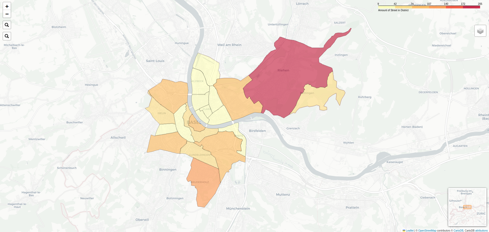

# Databases Project:  MakeLoveNotAccidents

| Version | Author                   |Documents|Status | Date |
| ------- | --------------------------|---------|------ | ----- |
|  0.3    |  Edi Zeqiri, Ugur Turhal | Complete |Finished | 09.01.2023 |

This Project is an analysis of vehicle accidents in correlation with the speed measurements in Basel. The data are 
stored in a integrated MySQL Database and it is visualized graphically in python. Everything needed is in this repository. 
To see the end result: please look at: 
- [https://databases.ugurturhal.io](https://databases.ugurturhal.io)
  - Click on **Map** to see our result.
  - Click on **Analysis** to download the analysis document.
  - **Note:** The access to the database in this version is not included in the PDF file, for security reasons. 

**_Please use the document from Adam to access to the database._**

___
### Generate map.

1. First install the requirements.txt file.

```
pip install -r requirements.txt
```

2. To create the map, please use the provided login in our Analysis file.
the login should be made in the Connector.py

```Python3
try:
  connection = mysql.connect(host='THE HOST', database="Integrated",
  user='root', password='YourPassword')
```

3. Run the python file map.py **Note:** It takes a good while, to produce the .html it open automatically in a browser. 
___
### Result. 


### Sources:

- https://data.bs.ch/explore/dataset/100120/table/?sort=accident_date

- https://data.bs.ch/explore/dataset/100097/table/?disjunctive.geschwindigkeit&disjunctive.zone&disjunctive.ort&disjunctive.v50&disjunctive.v85&disjunctive.strasse&disjunctive.fzg&sort=timestamp

- https://data.bs.ch/explore/dataset/100200/table/?disjunctive.geschwindigkeit&disjunctive.zone&disjunctive.ort&disjunctive.v50&disjunctive.v85&disjunctive.strasse&disjunctive.fzg&sort=timestamp
